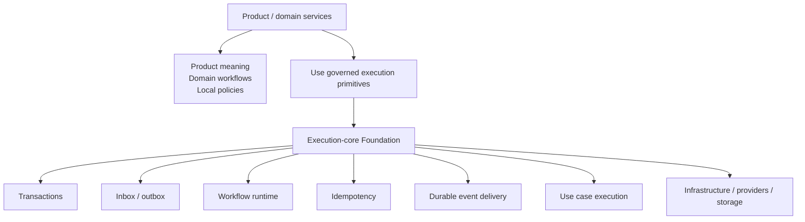

# Execution Core Boundary

Purpose: show the boundary between product/domain services and a deliberate execution-core Foundation.

This is a clean-room diagram. Do not add real names, repository details, service names, schemas, queues/events/tables, vendors, screenshots, logs, exact timelines, or client-specific topology.

## Mermaid version



## ASCII version

```text
Product/domain services
  - product meaning
  - domain workflows
  - local policies
        |
        v
Execution-core Foundation
  - transactions
  - inbox/outbox
  - workflow runtime
  - idempotency
  - durable event delivery
  - use case execution
        |
        v
Infrastructure / providers / storage
```

## What this diagram should clarify

- Foundation owns execution mechanics.
- Product/domain services own product meaning.
- Governance is needed because this boundary can drift.

## What this diagram must not imply

- every product should build Foundation early;
- Foundation owns all workflows or business meaning;
- product services should become thin wrappers.

## Related files

- [`../docs/02-execution-core-foundation.md`](../docs/02-execution-core-foundation.md)
