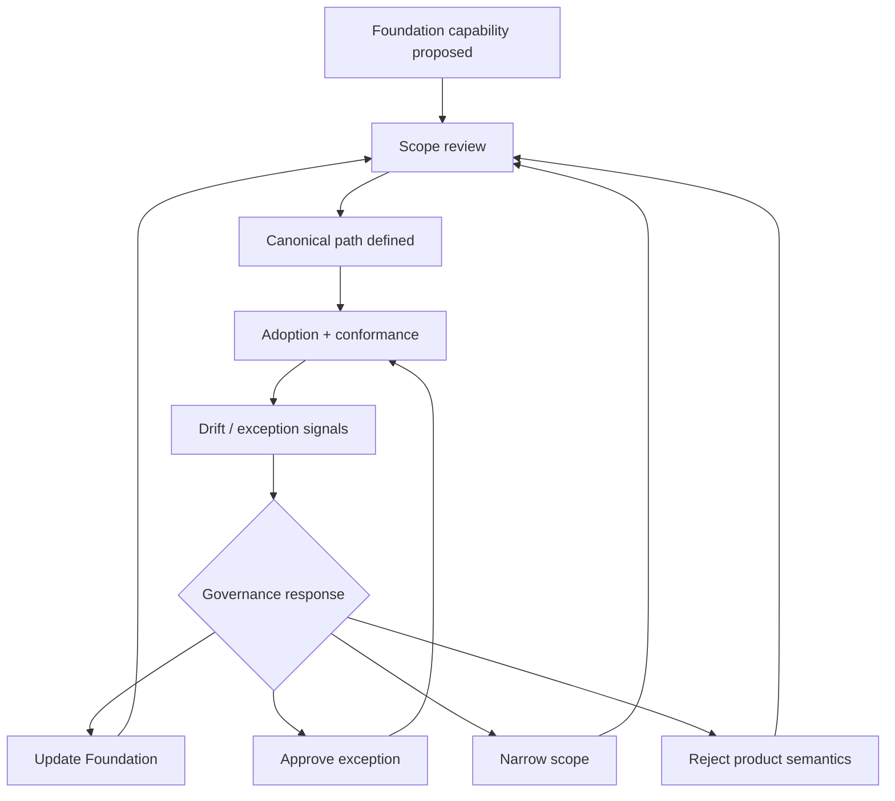

# Foundation Governance Loop

Purpose: show the operating loop that keeps deliberate Foundation scope coherent.

This is a clean-room diagram. Do not add real names, repository details, service names, schemas, queues/events/tables, vendors, screenshots, logs, exact timelines, or client-specific topology.

## Mermaid version



## ASCII version

```text
Foundation capability proposed -> scope review -> canonical path -> adoption + conformance -> drift/exception signals -> update Foundation OR approve exception OR narrow scope OR reject product semantics -> back to scope review
```

## What this diagram should clarify

- Governance is a loop, not a document.
- Scope can narrow as well as expand.
- Exceptions feed back into design.

## What this diagram must not imply

- governance is documentation only;
- every exception means failure;
- Foundation should expand whenever teams drift.

## Related files

- [`../runbooks/foundation-scope-review.md`](../runbooks/foundation-scope-review.md)
