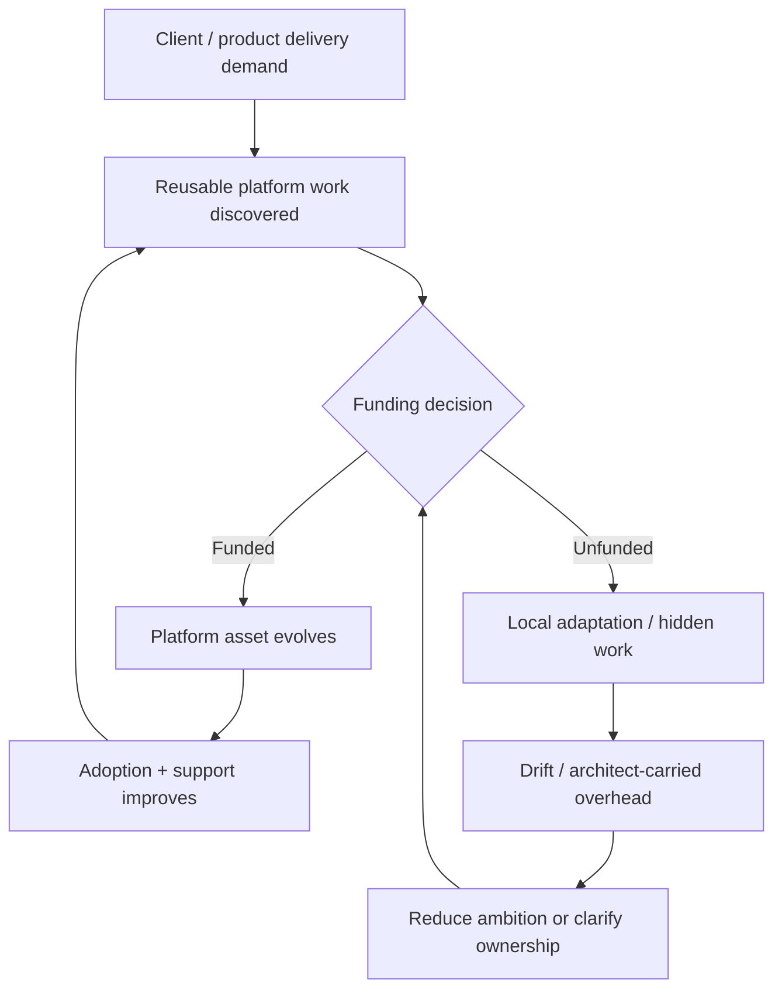

# Outsourcing Platform Funding Loop

Purpose: show that platform funding is an operating decision, not an afterthought.

This is a clean-room diagram. Do not add real names, repository details, service names, schemas, queues/events/tables, vendors, screenshots, logs, exact timelines, or client-specific topology.

## Mermaid version



## ASCII version

```text
Client/product delivery demand -> reusable platform work discovered -> funding decision
  funded -> platform asset evolves -> adoption/support improves
  unfunded -> local adaptation/hidden work -> drift/architect-carried overhead -> reduce ambition or clarify ownership
```

## What this diagram should clarify

- Funding covers adoption/support, not only code.
- Unfunded platform ambition often becomes local adaptation or hidden labor.
- Reducing ambition can be honest governance.

## What this diagram must not imply

- funding is the only cause of adoption shape;
- outsourcing makes platforms impossible;
- more budget automatically creates better architecture.

## Related files

- [`../templates/platform-funding-model.md`](../templates/platform-funding-model.md)
