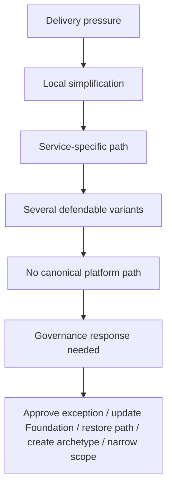

# Platform Drift Loop

Purpose: show how locally sensible choices can weaken a shared platform model unless governance responds.

This is a clean-room diagram. Do not add real names, repository details, service names, schemas, queues/events/tables, vendors, screenshots, logs, exact timelines, or client-specific topology.

## Mermaid version



## ASCII version

```text
Delivery pressure -> local simplification -> service-specific path -> several defendable variants -> no canonical platform path -> governance response needed
```

## What this diagram should clarify

- Drift can start from reasonable local choices.
- The problem is unsynchronized flexibility.
- Governance may update the platform, not only correct teams.

## What this diagram must not imply

- local teams are careless;
- every local deviation is wrong;
- platform rules should never change.

## Related files

- [`../runbooks/platform-drift-review.md`](../runbooks/platform-drift-review.md)
