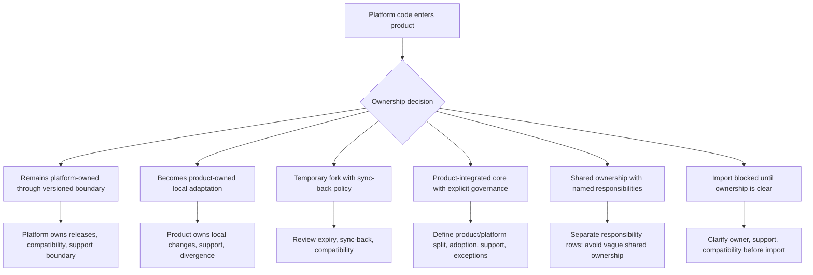

# Platform Import Ownership

Purpose: show how ownership changes when platform code enters a product through dependency, vendoring, copying, generation, fork, or local adaptation.

This is a clean-room diagram. Do not add real repository names, package names, service names, file paths, commits, vendors, or client-specific topology.

## Mermaid version



## ASCII version

```text
Platform code enters product
        |
        v
Ownership decision
        |
        +-- remains platform-owned through versioned boundary
        |       -> platform owns releases, compatibility, support boundary
        |
        +-- becomes product-owned local adaptation
        |       -> product owns changes, support, divergence
        |
        +-- becomes temporary fork with sync-back policy
        |       -> review expiry, compatibility, flow-back rules
        |
        +-- becomes product-integrated core with explicit governance
        |       -> define product/platform split, adoption, support, exceptions
        |
        +-- shared ownership with named responsibilities
        |       -> every responsibility has a named owner
        |
        +-- import blocked until ownership is clear
```

## Import mechanism comparison

| Mechanism | Ownership default | Watch for |
|---|---|---|
| Versioned dependency | Platform owns releases; product owns adoption. | Upgrade friction and compatibility gaps. |
| Vendored/copy import | Product often becomes local custodian. | Silent platform boundary loss. |
| Temporary fork | Shared intent, local divergence. | Temporary becoming permanent. |
| Generator output | Product owns generated code unless regeneration policy says otherwise. | Edits that break future regeneration. |
| Product-integrated core | Product/platform split must be explicit. | Product assumptions leaking into reusable assets. |

## Caption

> How code enters a product decides who owns the future cost of changing it.

## What this diagram should clarify

- Import mechanics are governance mechanics.
- A copied platform asset is not the same as a versioned platform dependency.
- Product-local adaptation can be valid, but ownership must change explicitly.
- “Shared ownership” is only useful when responsibilities are separated.
- Import should be blocked when ownership, support, and compatibility are unclear.

## What this diagram must not imply

- that vendoring is bad by default;
- that versioned dependency is always better;
- that product-integrated core is universally superior;
- that platform code remains platform-owned after import automatically;
- that code movement proves runtime ownership.

## Related files

- [`../templates/platform-import-adr.md`](../templates/platform-import-adr.md)
- [`../runbooks/platform-import-review.md`](../runbooks/platform-import-review.md)
- [`../docs/04-reuse-mechanisms.md`](../docs/04-reuse-mechanisms.md)
- [`../docs/05-governance-operating-model.md`](../docs/05-governance-operating-model.md)
