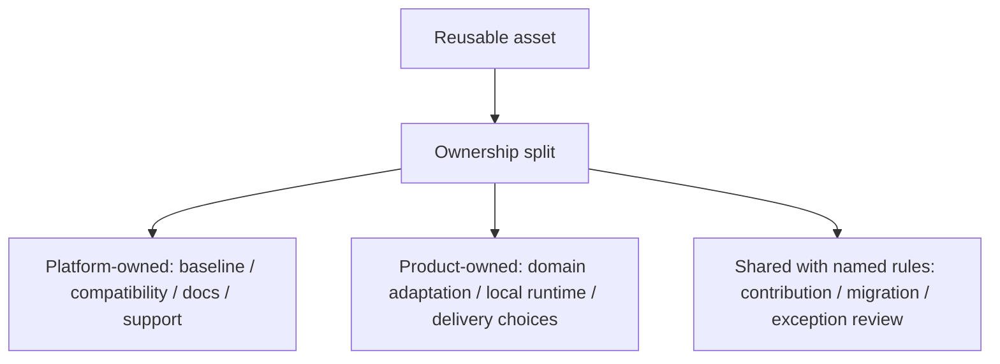

# Platform Ownership Split

Purpose: show that platform-owned, product-owned, and shared responsibilities must be decomposed.

This is a clean-room diagram. Do not add real names, repository details, service names, schemas, queues/events/tables, vendors, screenshots, logs, exact timelines, or client-specific topology.

## Mermaid version



## ASCII version

```text
Reusable asset
  -> platform-owned: baseline, compatibility, docs, support
  -> product-owned: domain adaptation, local runtime, delivery choices
  -> shared with named rules: contribution, migration, exception review
```

## What this diagram should clarify

- Shared ownership must be decomposed.
- Runtime ownership is separate from code ownership.
- Local adaptation can be valid if ownership changes explicitly.

## What this diagram must not imply

- every row must be platform-owned;
- product teams cannot own local runtime;
- code movement proves runtime ownership.

## Related files

- [`../templates/platform-ownership-split.md`](../templates/platform-ownership-split.md)
