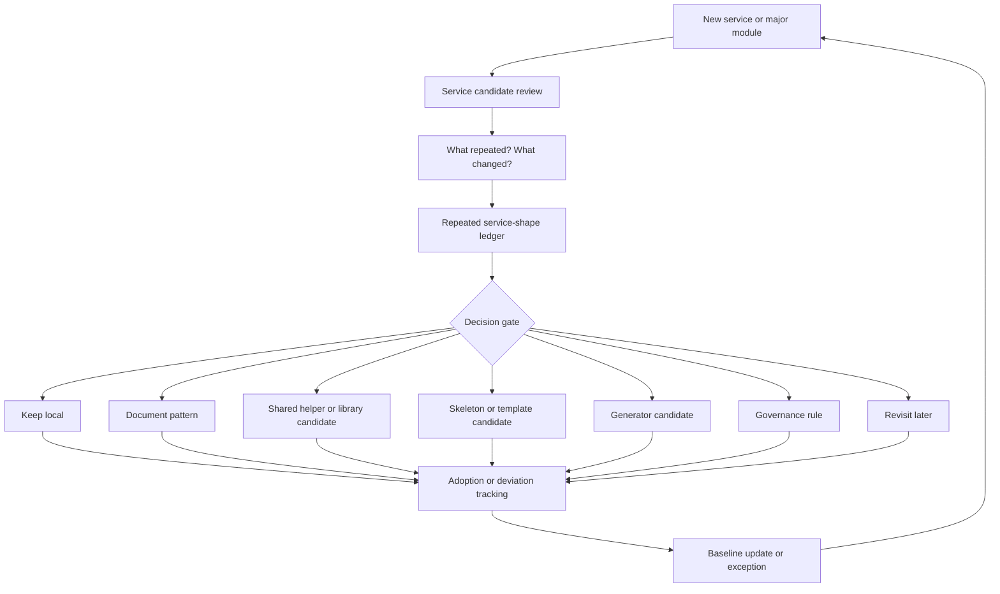

# Platform Signal Loop

Purpose: show how a new service or major module becomes an observation point for platform discipline.

This is a clean-room diagram. It should not be edited to include real service names, repository names, internal boards, issue links, schemas, queue names, vendors, or client topology.

## Mermaid version



## ASCII version

```text
                     PLATFORM SIGNAL LOOP

        New service / major module
                  |
                  v
        Service candidate review
                  |
                  v
        What repeated? What changed?
                  |
                  v
        Repeated service-shape ledger
                  |
                  v
        Decision gate
        -------------------------------------------------
        | keep local | document | shared lib | skeleton |
        | generator  | governance rule       | revisit  |
        -------------------------------------------------
                  |
                  v
        Adoption / deviation tracking
                  |
                  v
        Baseline update or exception
                  |
                  +------------ back to next service
```

## How to use this diagram

Use it in:

- architecture reviews;
- article companion sections;
- onboarding for platform discipline;
- monthly platform signal review;
- conversations with engineering leadership about why platform work needs memory, not only code.

## Caption

> Discipline makes platform signals visible before they become platform debt.

## What this diagram should clarify

- A new service is not only a delivery task. It is also an architecture observation point.
- Repetition should be logged before it becomes drift.
- Promotion is not automatic.
- Local deviations should feed the baseline instead of disappearing.
- Platform discipline is a loop, not a one-time framework decision.

## What this diagram must not imply

- that every service becomes a platform candidate;
- that every repeated concern should be extracted;
- that governance means heavy ceremony;
- that the loop existed historically in this exact form;
- that AI, tools, or diagrams can replace architectural judgment.

## Related files

- [`../docs/01-bottom-up-platform-discipline.md`](../docs/01-bottom-up-platform-discipline.md)
- [`../templates/service-candidate-register.md`](../templates/service-candidate-register.md)
- [`../templates/repeated-service-shape-ledger.md`](../templates/repeated-service-shape-ledger.md)
- [`../runbooks/monthly-platform-signal-review.md`](../runbooks/monthly-platform-signal-review.md)
