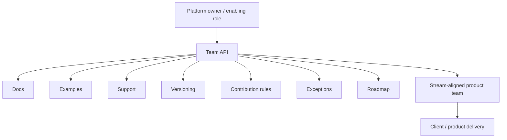

# Platform Team API

Purpose: show that platform adoption needs an interaction model, not only code.

This is a clean-room diagram. Do not add real names, repository details, service names, schemas, queues/events/tables, vendors, screenshots, logs, exact timelines, or client-specific topology.

## Mermaid version



## ASCII version

```text
Platform owner / enabling role
        |
        | team API: docs, examples, support, versioning,
        | contribution rules, exceptions, roadmap
        v
Stream-aligned product team
        |
        v
Client / product delivery
```

## What this diagram should clarify

- Platform adoption has a team interface.
- Docs alone are not a team API.
- Enabling capacity may be required before self-service works.

## What this diagram must not imply

- every organization needs a separate platform team;
- team API means bureaucracy;
- self-service exists before adoption is learned.

## Related files

- [`../templates/team-api.md`](../templates/team-api.md)
