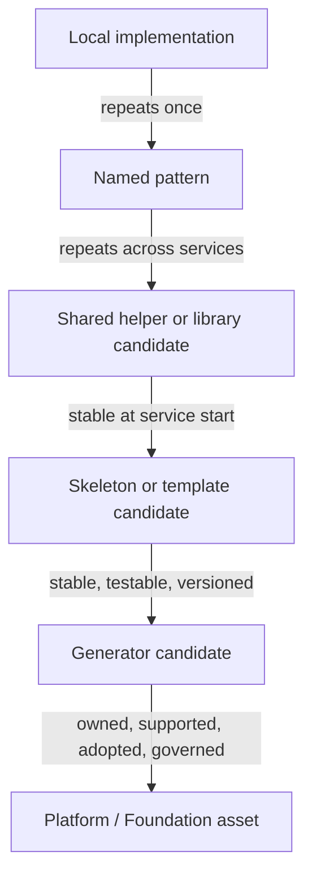

# Promotion Ladder

Purpose: show how a local implementation can become platform material only after evidence, stability, ownership, and governance appear.

This is a clean-room diagram. Do not add real service names, repository names, implementation details, internal examples, vendor names, or client-specific references.

## Mermaid version



## ASCII version

```text
                 FROM SIGNAL TO PLATFORM ASSET

Local implementation
        |
        | repeats once
        v
Named pattern
        |
        | repeats across services
        v
Shared helper / library candidate
        |
        | stable at service start
        v
Skeleton / template candidate
        |
        | stable, testable, versioned
        v
Generator candidate
        |
        | owned, supported, adopted, governed
        v
Platform / Foundation asset
```

## Gate criteria

| Step | Promotion question | No-go signal |
|---|---|---|
| Local implementation → named pattern | Did the same concern appear again? | One implementation only. |
| Named pattern → shared helper/library candidate | Is divergence costly and the concern stable? | Product meaning is still unstable. |
| Shared helper/library → skeleton/template candidate | Should new services start with this baseline? | Service archetypes need different defaults. |
| Skeleton/template → generator candidate | Can the output be tested, versioned, and safely changed? | Generated output diverges immediately. |
| Generator candidate → platform asset | Are ownership, support, adoption, exceptions, and compatibility defined? | No owner or upgrade path. |

## Caption

> The ladder is not automatic. Every promotion needs evidence, ownership, and a lower cost for the next service.

## What this diagram should clarify

- Repetition is the start of evidence, not permission to platformize.
- Shared code and generated code are intermediate states.
- Ownership and support are promotion gates, not paperwork after the fact.
- A useful asset can stay below platform level if governance is not ready.

## What this diagram must not imply

- that every pattern should climb the ladder;
- that generators are always the next maturity step;
- that a platform asset is better than a local pattern in every context;
- that promotion is linear in real life;
- that a template or generator is governance by itself.

## Related files

- [`../docs/01-bottom-up-platform-discipline.md`](../docs/01-bottom-up-platform-discipline.md)
- [`../docs/04-reuse-mechanisms.md`](../docs/04-reuse-mechanisms.md)
- [`../templates/shared-library-register.md`](../templates/shared-library-register.md)
- [`../templates/skeleton-readiness-checklist.md`](../templates/skeleton-readiness-checklist.md)
- [`../runbooks/repeated-pattern-review.md`](../runbooks/repeated-pattern-review.md)
