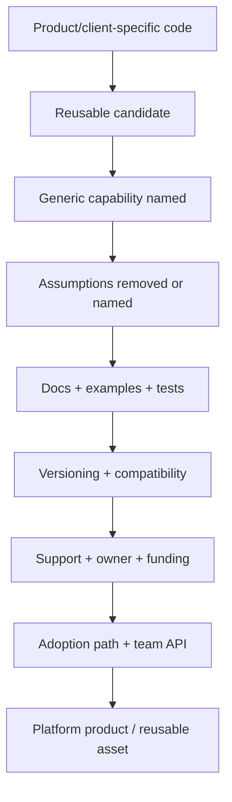

# Reusable Asset Productization Funnel

Purpose: show the path from context-specific code to productized platform asset.

This is a clean-room diagram. Do not add real names, repository details, service names, schemas, queues/events/tables, vendors, screenshots, logs, exact timelines, or client-specific topology.

## Mermaid version



## ASCII version

```text
Product/client-specific code -> reusable candidate -> generic capability named -> assumptions removed or named -> docs/examples/tests -> versioning/compatibility -> support/owner/funding -> adoption path/team API -> platform product
```

## What this diagram should clarify

- Reuse is not productization.
- Old code must be generalized and supported.
- Team API and funding are part of productization.

## What this diagram must not imply

- all client/product code should become platform code;
- one successful use proves platform readiness;
- productization removes governance.

## Related files

- [`../templates/reusable-asset-productization-checklist.md`](../templates/reusable-asset-productization-checklist.md)
