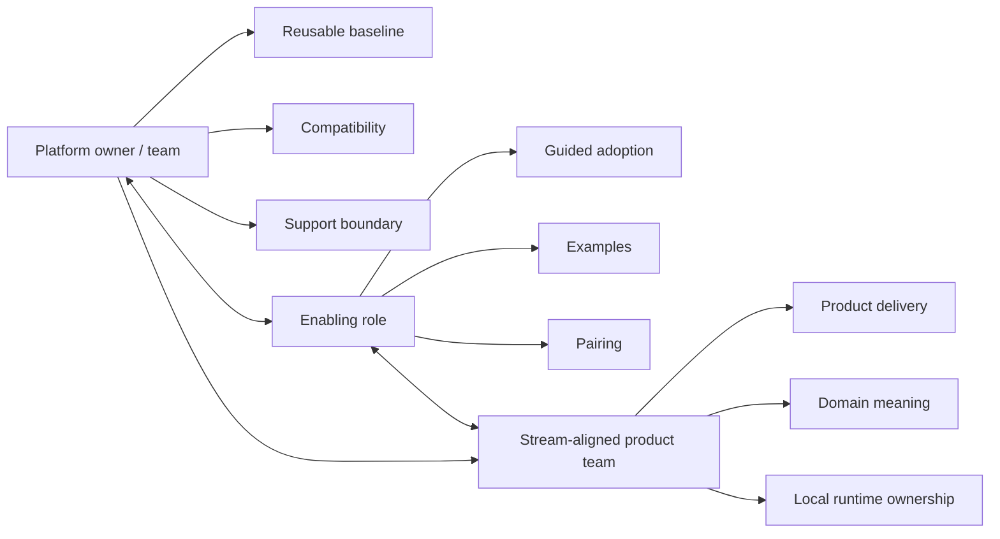

# Stream-Aligned Product Team vs Platform Team

Purpose: show why product delivery and platform stewardship are different responsibilities.

This is a clean-room diagram. Do not add real names, repository details, service names, schemas, queues/events/tables, vendors, screenshots, logs, exact timelines, or client-specific topology.

## Mermaid version



## ASCII version

```text
Stream-aligned product team: product delivery, domain meaning, local runtime ownership
Platform owner/team: reusable baseline, compatibility, support boundary
Enabling role: guided adoption, examples, pairing
Combine roles only when capacity and ownership are explicit.
```

## What this diagram should clarify

- Product delivery and platform stewardship are different work types.
- Enabling capacity may be needed during adoption.
- Combining roles requires explicit capacity.

## What this diagram must not imply

- every small organization needs three formal teams;
- product teams are incapable of platform work;
- topology beats delivery reality.

## Related files

- [`../docs/08-team-topology-and-team-api.md`](../docs/08-team-topology-and-team-api.md)
