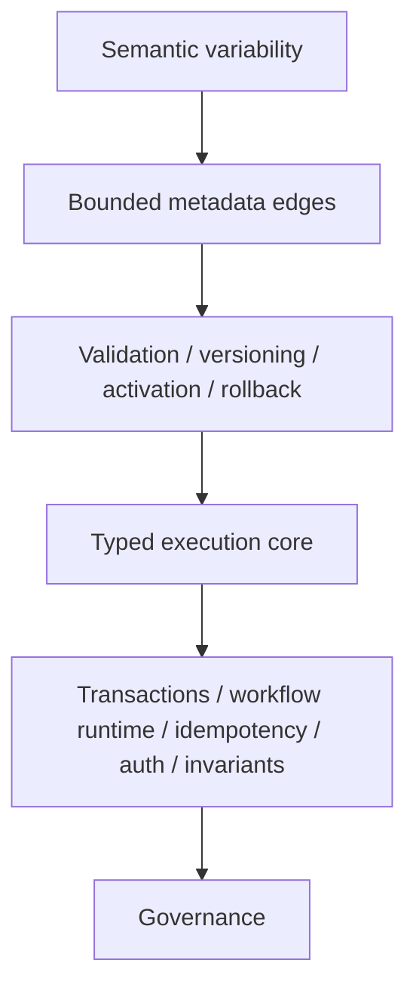

# Typed Core, Metadata Edges

Purpose: show semantic variability at bounded edges while typed execution remains governed.

This is a clean-room diagram. Do not add real names, repository details, service names, schemas, queues/events/tables, vendors, screenshots, logs, exact timelines, or client-specific topology.

## Mermaid version



## ASCII version

```text
Semantic variability
  catalogs / mappings / transforms / activation
        |
        v
Bounded metadata edges
  validation / versioning / promotion / rollback
        |
        v
Typed execution core
  transactions / workflow runtime / idempotency / authorization / invariants
        |
        v
Governance
```

## What this diagram should clarify

- Metadata belongs at bounded semantic edges.
- Typed execution core remains code-owned.
- Configurable does not mean unowned.

## What this diagram must not imply

- metadata is the future of everything;
- product semantics should dissolve into configuration;
- configuration can replace ownership.

## Related files

- [`../docs/03-typed-core-metadata-edges.md`](../docs/03-typed-core-metadata-edges.md)
