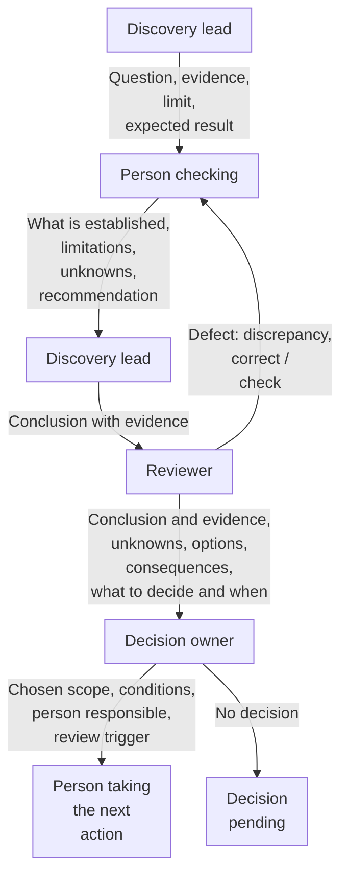
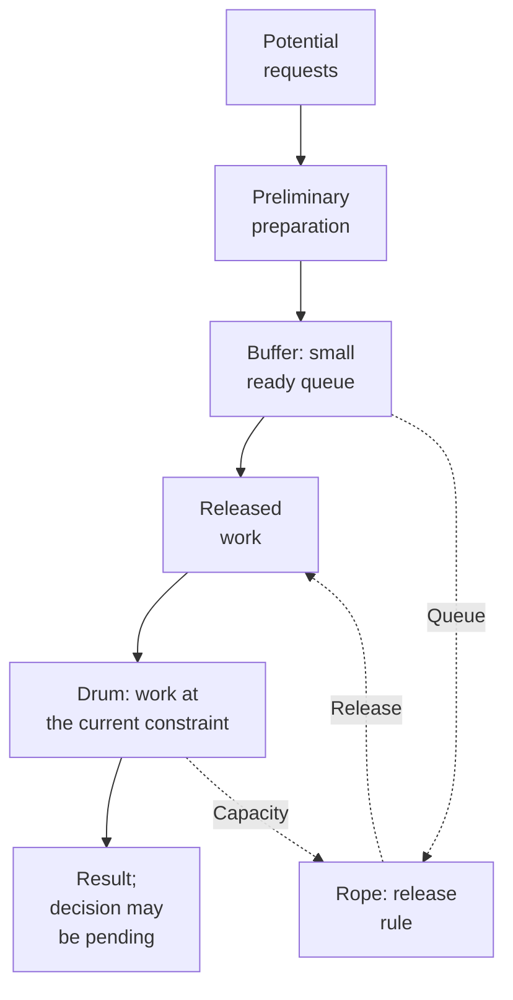

# Outsourcing / presales — from a request to sound commitments

[Back to the Playbook](../README.md) · [Core](../core.md) · [Research work](../research-work.md)

In presales, discovery helps establish what the team can reasonably offer the client, under what conditions, and what still needs to be clarified. The next decision may be small: whether to take on a request, estimate a particular scenario, check an integration, or first clarify the task with the client.

Here, [Core](../core.md) is supplemented by rules for handing over context, reviewing results, and making commitments. A brief conversation is sometimes enough for a familiar change. Whether a separate discovery project is needed depends on what is unknown, not simply on the arrival of a new deal.

## Qualification before allocating a budget

A request to “replace the CRM” or “rewrite it using a different technology” specifies a desired action, but does not by itself establish the cause of the problem. If the cause could change the scope or architecture, first gather enough facts about how the work actually happens to inform the next decision: for example, examine where a request gets lost and what precedes that. The client's proposed solution remains an option or a binding constraint; full implementation must not be required as the first step in establishing whether it is needed.

If the client has already diagnosed the problem sufficiently or has a sound basis for a binding decision, check that those grounds apply and work within the agreed boundaries. This is not a reason to impose a company-wide audit or restart discovery because the architect disagrees.

Before promising every client the same package, establish what the work will actually involve:

- **Familiar adaptation:** relevant experience exists; differences, constraints, and the scope of changes need to be checked.
- **Aligning people and process:** information exists, but is spread across participants, is contradictory, or requires a client decision.
- **Research:** the problem, first scenario, or acceptability of the solution to the audience is unknown; appropriate external evidence is needed.
- **Technical uncertainty:** a material capability, compatibility, data availability, or suitability of an existing component needs to be checked.
- **A combination of these:** for example, an interview identifies the scenario, then a technical test checks its feasibility.

These are prompts for a conversation, not a mandatory classification. The nature of a request may change as more becomes clear. Before allocating a budget, it helps to name the next decision, the intended check, and material dependencies. If even these are unclear, first limit the effort spent clarifying the request.

Also clarify what result is being purchased: a scope description, architectural work, a hypothesis test, or an agreed combination. A completed architecture does not prove demand; an agreed product description does not confirm that an integration works. Before promising a package, identify the required [competencies](../core.md#evidence), participants' availability, and the cost of their involvement: finding a market use case may require different skills from a technical estimate.

## Sales handoff

The team needs the context that affects the decision and promises made. This can be passed on through an existing deal record or a brief conversation that records the material points:

- why the client came now and what result they need;
- what has already been promised and what is being discussed as a possibility;
- known budget and time constraints;
- who makes decisions on the client and supplier sides;
- who knows the domain, and which people, materials, and access are available;
- known dependencies, contradictions, and conditions on which the proposal was based.

Access to the entire sales history and unrelated commercial data is not required. Mark unknowns explicitly: missing budget information does not mean the budget is unlimited, and discussing a feature does not mean committing to deliver it.

Before starting a dependent check, make sure the necessary specialist or access is actually available, or that there is an agreed way to obtain it. Otherwise, record the dependency owner and when the next decision is due. Safe independent work can continue; waiting for an answer should be shown separately from effort spent.

## Who leads, who reviews, who decides

Preparing a conclusion, reviewing its substance, and choosing an action are different functions. The discovery lead keeps the next question in focus, organizes evidence gathering, brings the results together, and raises blockers. Assigning functions does not replace the subject expertise needed for the check.

Bring relevant specialists and affected client and supplier stakeholders into the work while they can still change the framing, options, or interpretation. Share the purpose, relevant evidence, plausible alternatives, trade-offs, and specific input needed before final review. Participants may bring contrary evidence, constraints, or a better option.

### What to hand over between participants

This map shows delegation and transfer boundaries. It does not replace joint problem framing or prescribe a sequence inside a product team. It does not require four separate people or departments; a simple question can bypass it. The next action may be a pause or a decision not to proceed; its recipient is whoever is assigned that work. Completed analysis is not a decision, and silence is not agreement. While a decision is pending, dependent implementation is not authorized; permissible independent work continues.

Tailor the handoff to the next task. A reviewer needs the relevant original material and conditions; a decision owner needs the choice, alternatives, consequences, and supporting grounds; a coordinator needs current decisions and next work. Preserve source access where permitted. Neither the entire archive nor the same short summary suits every recipient, and brevity must not hide contrary evidence.

The recipient must understand the assigned check. Teams can act within their delegated authority; shared understanding does not expand it. **Delegating a check does not transfer authority over budget, scope, or acceptance of residual risk.** Correcting a factual error requires appropriate evidence; management escalation requires a choice of action. A manager can fund a check or choose a workaround, but cannot declare that an unconfirmed API capability exists. A conclusion with a known contradiction must not be carried into the estimate as confirmed.

### Who prepares, reviews, and chooses the action

| Question or result | Who prepares it | Who provides expert review | Who may choose the next action |
|---|---|---|---|
| How the client's process works | The person carrying out the check, with process participants | A competent participant who knows the process | The owner of the affected process and commitments |
| Technical conclusion and option | An engineer or architect | A specialist in the relevant area | The authorized owner of the technical decision |
| First phase or a change in timing | The discovery lead with subject matter experts | Participants checking scope and dependencies | Owners of the affected client and supplier commitments |
| Response to a material risk | The person who identified the risk, with a relevant specialist | A specialist in the relevant subject | The decision owner, within their authority |
| Handing the result on | The discovery lead with those who produced the result | Competent participants checking consistency across the whole package | The owner of the next action, within agreed boundaries |

This is an example of assigning functions, not a job description. Functions can be combined where the nature of the work allows it; a separate independent check is needed where it is actually required. Identifying a risk does not make that person responsible for all its consequences. The client and supplier may have different owners of commitments: one side's internal decision does not automatically change the other side's commitments.

Review both whether a conclusion follows from the material and remains consistent with accepted decisions, and whether the result covers the scenarios, constraints, scope boundaries, reasoning, and unresolved questions its recipient needs. These checks do not require two reviewers. Completeness is relative to that use, not length. Do not remove a necessary scenario merely to eliminate a contradiction: correct it or explicitly agree on a change in scope.

**From my practice.** After a corrected business requirements document became inadequate as a product description, I asked for its substance to be restored. The next pass started with an outline and a map of the source material, then assembled the document section by section. Later cleanup removed repetition and internal clutter.

That approach is useful when a large synthesis loses content; it is not a required document pipeline. Check the assembled result as a whole: the description, diagram, mockup, and estimate must express the same decision with the same constraints.

For a substantial accepted correction, inspect the current passage, a visible diff, and affected downstream materials. Check that the correction took effect and preserved needed coverage; an acknowledgment, proposed patch, filename containing “Final,” or tracker status does not establish a changed result. The [shared research procedure](../research-work.md#check-the-result-challenge) covers this check. Technical review, including permitted automated review, does not confer authority to change scope or budget; client acceptance is covered separately below.

## Fixed effort and the limits of the result

**An effort limit is how much you are prepared to spend on a question. A guaranteed result is a separate commitment.** One does not follow from the other.

For example, an allocation of 20–25 hours may define available capacity, but does not promise an equally precise estimate for every request. This is an illustrative example, not a standard. Before starting, agree on what will be checked, what result will be handed over, and what evidence will be enough for the next action.

If the limit includes a technical test, you can agree to provide a report on the conditions checked and their limitations. The limit alone cannot imply a promise that the required capability will be confirmed. Agree explicitly on acceptance criteria for paid work. The intended business effect explains its purpose; it does not replace those criteria or guarantee results beyond the engagement's scope or control.

At the effort limit, review the evidence and choose an estimate for confirmed scope, a narrower option, another justified check, waiting, or stopping. The full [Sufficient depth](../core.md#sufficient-depth) rule applies: paid capacity neither proves readiness nor automatically authorizes more spending. Continuation needs a useful purpose and agreed scope and effort; it need not collect new observations.

## When the client uses AI for responses and acceptance

AI can help prepare responses and review the result. Problems arise when it is unclear which comments the client adopts as their position, who decides on the tradeoff, and when the work ends. This can also happen with a corporate client or internal stakeholder. Writing style cannot establish AI use or the author's lack of competence; rules for reaching agreement are useful regardless of where the text came from.

**Agree on acceptance before substantial work.** Name the person responsible for the client's choice, the contents of the result, the criteria, how comments will be collected, and the conditions for revisiting iteration limits. There is no universal number of rounds. If the client cannot yet choose a direction, the next result may be a bounded clarification rather than a full specification.

| Content of the comment | What to check | How to proceed |
|---|---|---|
| Fact or contradiction | The specific passage and appropriate evidence; for behavior, the conditions for reproducing it | Correct a confirmed error in your own work; leave unverified points open |
| Clarification of understanding | Which meaning or condition participants understood differently | Clarify the wording and shared understanding; refer a material choice to its owner |
| New requirement or expansion | The difference from agreed scope, assumptions, and impact on timing and price | Obtain a decision from the authorized client representative; agree separately on inclusion in paid scope |
| Editing | Whether only the wording changes, or also meaning and commitments | Improve the wording; handle a change in meaning under the relevant row |

The table applies to the content of text from a person or AI, not to a guess about authorship. A comment may be correct, but until checked it reports a possible error, not a proven defect. A single message may contain both a defect and new scope; handle them separately. You must not dismiss a reproducible error in your own work just because the correspondence limit has been reached: fix a BRD error in the BRD. For a material comment, ask for the relevant passage, evidence, or expected change; no special machine-readable format is required from the client.

**Obtain explicit confirmation of a material choice.** An authorized person must accept the conditions of the chosen option. Clear written confirmation is enough; where there is ambiguity, a brief conversation about the specific options can help. This is not a test of the client or a mandatory call for every question. An AI suggestion they adopt can become a requirement; this is separate from confirming its premise and including it in the current paid scope.

The way a claim is checked must match the [question](../core.md#evidence): check demand with the audience, and a technical question against the system or through a permitted test. Another model response, or agreement between two models, does not by itself substantiate a market claim. AI can find a primary source or carry out an authorized check; the basis is the verifiable source or result with its conditions, not the persuasiveness of the text.

**End an iteration with a concrete next step.** If a round produces no new evidence, material clarification, or change in the choice, summarize the open questions and agree on the next action. If no decision has been made, record what remains undecided, whose answer is needed, and what independent work can continue. If acceptance cannot be agreed, the owner is unavailable, or resources for the next phase are unavailable, narrow or pause the dependent part. AI use by itself is not a reason to turn a client away.

Automated checks under previously agreed conditions are permissible; their results are accepted within those limits. Delegating technical review does not give an agent authority to change scope, timing, budget, or acceptance criteria. A named person on the client side is responsible for the acceptance arrangement and material decisions. Neither their silence nor an agent's conclusion outside the agreed conditions provides automatic acceptance or authority to expand scope.

The same rules apply to the supplier: their AI drafts are also subject to substantive criticism. Do not bypass someone else's reviewer, try to manipulate their instructions, or send confidential materials to unauthorized tools. Data access conditions remain in force for both sides.

An illustrative exchange after agreeing on one scenario for the first phase:

> **Client:** “The comments identify an incorrect description of request confirmation. They also suggest bulk operations and reports — add those.”
>
> **Team:** “We'll correct the description. Bulk operations and reports expand the agreed phase: they require additional scenarios and checking, and the estimate and timeline need to be revised. Please confirm what to include now and what to defer to make room, or we can keep the original scope.”

## Moving to an estimate, SOW, and development

An estimate applies to a specific scope and set of conditions, and confidence in it depends on the supporting evidence. The handoff must distinguish:

- confirmed scope and its version;
- material assumptions and the consequences if they do not hold;
- dependency status, including the availability of client inputs;
- exclusions, open questions, and decisions needed before a commitment or launch.

If the basis is weak, show a range or conditional options and explain why. An arbitrary contingency does not replace information about an unconfirmed integration.

A repository, component catalog, or demonstration does not yet establish a ready capability for a new commitment. Before promising reuse, [check applicability to the specific scenario and material readiness constraints](product-company.md#make-constraints-part-of-the-decision). Estimate adaptation, integration, rollout, team adoption, and ongoing ownership: the cost is not limited to writing the missing code. A full platform audit is not required for this; current checks can be used if they cover the relevant conditions. Compare the cost of using the available solution with the cost of replacing it — this rule does not prescribe a rewrite.

The overall concept, initial paid scope, and future options can coexist, but must remain distinct. A narrow implementation scope can still have a useful product explanation. A roadmap capability is not automatically included in the statement of work (SOW), the agreed description of work. Do not let an old architecture prompt silently restore excluded features; propose and agree a justified new requirement explicitly. Mandatory conditions for safe operation must not be hidden among optional extensions.

A simple handoff safeguard: preserve the label “assumption pending verification” with its open question, owner, and review condition. It can support bounded, reversible exploration without becoming a final answer. Explicitly resolve a known contradiction or retain it as an open condition; do not silently carry it into the estimate or code as confirmed. If a material finding changes the basis, update the estimate and SOW; where commitments are affected, agree on the change with their owners.

Completing a description, signing off on commitments, and going into operation may require different depths of investigation. An open question need not block everything at once: identify exactly which action depends on it, who is responsible, and when the answer is needed. Confirming the original plan is also a valid result.

A finite engagement can finish under its agreed acceptance criteria while later product results remain unknown. For a consequential choice, hand over the material assumptions, the observation that matters, and the review trigger. Continuing observation needs a receiving owner who accepts the responsibility and has capacity, access, and resources, or separately agreed follow-on scope. If no one can take it on, state the gap; naming a recipient does not create a feedback loop or extend the engagement into unpaid monitoring.

## Flow control when discovery becomes a queue

**Drum–Buffer–Rope (DBR) from the Theory of Constraints can be adapted as a flow-control model when several discovery items compete for the same scarce capacity.**

Sales can generate opportunities faster than the team can check the basis for commitments. Starting everything at once increases work in progress and context switching. Assigning another task does not by itself bring a decision closer.

### How the ready queue and work release connect

This is a conceptual diagram of the adaptation: solid arrows show the movement of work; dotted arrows show release control. **Preparing inputs and starting an active check are different.** Preparing the next input does not require waiting for the buffer to empty or stockpiling research; having a queue does not authorize starting everything at once. New work is released according to the constraint's capacity. Comparing alternatives does not release additional tests beyond that capacity. A pending decision does not authorize dependent implementation; if agreement is holding up the flow, it can itself become the current constraint.

Work at the current constraint sets the pace of the flow. The constraint is not automatically the BA and architect: it may be a client's subject matter expert, a person making product decisions, a specialist in mandatory requirements, or an available test environment. It can change. A ready input has a clear question, context, prior promises, and the information, people, or environment needed for its next check. The buffer is not a BRD or a pile of unprocessed documents; the rope is a release rule, not a call or a document-writing stage.

Choose the queue size so that constrained capacity does not sit idle for lack of basic inputs; there is no universal number of tasks. Sales continues to qualify opportunities, but the date of a request does not mean research starts immediately. New interviews or checks can also be released after previous results have been processed, if the next question depends on them.

A practical minimum: active tasks, the ready queue, blocked inputs, and the person choosing the next priority are visible. If an urgent request displaces another, discuss the consequences for both promises explicitly. Check how many sound decisions and feasible commitments pass through the system and where they wait. Keeping the architect fully utilized is not the goal.

This is flow control, not a research method or a sixth Core element. It is not required for a single simple hypothesis without competition for capacity. In a startup or product company, this adaptation is appropriate only when the same flow problem exists.

The original logic is described in [Eliyahu Goldratt's material on DBR and buffer management](https://www.toc-goldratt.com/en/product/GSP-on-Operations-DBR-and-Buffer-Management). The small queue of prepared discovery items and the readiness rules above are an adaptation proposed by this playbook.

After completing several pieces of work, it helps to examine specific losses: where a contradiction surfaced late, what was lost in a handoff, and why a wait came as a surprise. Add a safeguard against an observed failure, not another document for every possible case.

---

[Back to the Playbook](../README.md) · [Core](../core.md) · [Startup](startup.md) · [Product company](product-company.md)
