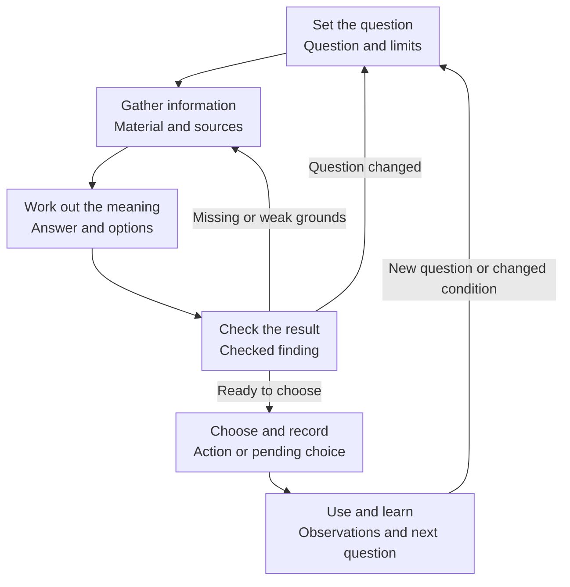
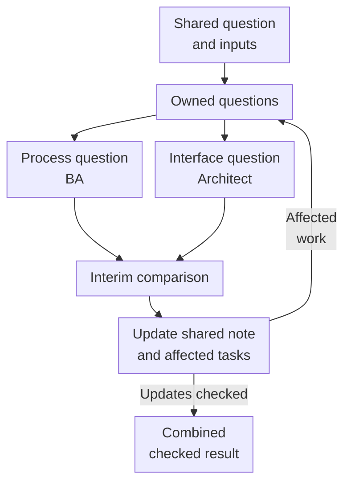

# Research work — from one question to a checked action

[Back to the Playbook](README.md) · [Core](core.md) · [Working note](core.md#working-note) · [AI-assisted research](ai-assisted-research.md)

Use this page when a question needs new material, related checks, or coordination. A clear small question with sufficient applicable evidence can go straight to a choice.

The [Core](core.md) and the six functions on this page do different jobs. The Core tells you what must remain connected for a sound decision. The functions describe the work that may be needed to get there. Start with the function the current problem needs; combine or repeat them as the inquiry changes.

| Core element | Where it appears in the work |
|---|---|
| Decision | Frame: state the choice or learning goal, purpose, owner, and timing. |
| Uncertainty | Frame: identify questions and explain how their answers could change the next action. Revisit them when findings change the problem. |
| Evidence | Acquire, Interpret, Challenge: obtain suitable material, draw a conclusion, and check its basis, limits, and useful coverage. |
| Sufficient depth | Before a material check, set the needed result and limits. Revisit them when the result, conditions, or remaining effort change. |
| Decision / stop | Decide & record, Act & learn: choose or identify a pending choice, update affected work, carry out the agreed action, and return relevant observations. |

## Work through one research question

### Set the question (Frame)

State what must be learned, for whom, and what action it enables. Name the expected result, exclusions, effort, review point, and method in the [working note](core.md#working-note) or current task.

#### Break the request into research questions

Use this when a request is too broad to assign or several investigations must contribute to one answer. A clear small question needs no tree.

1. **Write the main question and limits.** A requested solution is an option or accepted constraint, not a diagnosed cause.
2. **List the questions it depends on.** Use a shallow outline. Check for a missing perspective or different framing; avoid asserted causes and lists of desired components.
3. **Explain what each answer could change.** Merge accidental duplicates and show genuine dependencies.
4. **Select work for now.** Weigh consequences, usefulness to the next choice, dependencies, available evidence, and checking cost. An external constraint can matter even if the team cannot change it.
5. **Assign selected questions:** human owner, material or method, expected return, and affected colleague or decision. Mark deferred questions and why they can wait.
6. **Have owners restate the work.** Stop decomposing when each can explain what they will inspect, return, and potentially change in the common answer. Different candidate answers remain welcome.

Keep the selected questions and reasons in the shared note. Revise them when findings change the problem.

### Gather information (Acquire)

Use documents, firsthand accounts, data, observation, or an authorized technical check suited to the question. Keep the source, version, relevant passage or observation, conditions, and remaining gaps with the finding. Confirm that the method can observe what you need: imagined behavior cannot establish actual behavior, and a summary does not automatically supersede a firsthand account. If applicable evidence is already sufficient, use it; otherwise change method or narrow the dependent action.

### Work out what it means (Interpret)

Compare options, including the current approach where relevant, against the question and constraints. Separate observations, explanations, assumptions, recommendations, and choices; return grounds, alternatives, limits, and open questions. Trace repetition to its origin: retellings add no observations, while one file can contain distinct observations. Common instructions can be valid constraints without being independently discovered demand. An empty field is unknown, not a negative result; an absence claim needs a method capable of detecting the event. See [Evidence](core.md#evidence).

### Check the result (Challenge)

Check whether conclusions follow from their grounds and accepted decisions. Separately check that the recipient still has the needed scenarios, constraints, options, and open questions; one person can do both. Record the correction to an important objection or why it remains unresolved or was rejected.

Inspect an accepted correction in the current passage, a visible diff where available, and affected materials. An acknowledgment is not a changed result. Restore content removed by the correction or explicitly rescope it. If a large synthesis loses sections, map an outline to sources, assemble by section, and check the whole; this is a remedy, not a required pipeline.

### Choose the next action and record it (Decide & record)

Present options, grounds, and consequences to the person authorized to choose. Record the action or pending choice, owner, conditions, and affected work. Wording can be corrected within delegation; changing scope or commitments needs the appropriate authority. A working assumption can support bounded, reversible exploration when its question, owner, and review condition stay visible; it does not authorize deployment.

### Use the result and learn (Act & learn)

Perform the agreed action or preserve the reason for a pause. Name who will observe what result and whether they have access and resources. Return what happened, the changed assumption, and the next question or review condition. A finite engagement can end with later effects unknown if the follow-through boundary and ownership gaps stay visible.

## Work with other researchers

Split work when separate expertise, methods, searches, or volume justify the coordination cost. Sharing inputs does not guarantee shared interpretation.

### Agree the assignments

Before separating, agree the main question, scope, current sources, assumptions, exclusions, expected combined result, effort, and first comparison point. Distinguish decisions from proposals and older material. Each person states their question, return, exclusions, and dependencies; compare them before expensive dependent work.

This small specimen supports the fictional request-transfer inquiry in the [AI guide](ai-assisted-research.md#worked-example); it also shows the information an assignment needs without requiring AI:

| Question and owner | Material and result to return | Dependency and first sharing point |
|---|---|---|
| Operator work beyond copying — BA | Inspect complete and incomplete cases; return actions, exceptions, and unknowns. | Share before unattended design because required human work could change the option. |
| Receiving-interface support — architect | Inspect documentation and access conditions; return established capabilities and draft/hold or retry gaps. | Share when limits change the scenario; keep documentation separate from assumptions. |
| Useful comparison before system access — research lead with both owners | Combine process findings and permitted methods; return compared options and a next check. | Compare first findings before handoff; preserve what the check cannot answer. |

Process understanding and technical gaps come before detailed unattended design; documentation review can run in parallel. Access matters even if the team cannot grant it. Savings wait for actual use; bulk processing and delivery effort are outside this specimen. One person may own several questions. Coordination exposes dependencies and maintains the combined result without settling disputed facts or expanding authority.

Compare initial findings before substantial dependent work and the combined result before handoff. Add later comparison points around dependencies. Share sooner when a finding changes scope, method, assumptions, or permission. Intentionally separate searches can protect independence: agree their question and comparison point without forcing early agreement.

### Share a finding

Send the finding and source, remaining uncertainty, affected work, requested response, and next step. An activity count such as “read ten sources” does not tell a colleague what needs changing.

### Write a working answer before the final report

After an initial look, use a working answer when separate investigations could develop incompatible premises. A clear small question needs no extra note or checkpoint.

1. Write a provisional answer in one or two sentences. If none is defensible, name the alternatives and missing information.
2. Put its basis beside it. Separate observations or documentation from untested premises; keep a significant alternative visible.
3. Name what could change it. Connect that uncertainty to an owned question and suitable check; seek contrary evidence too.
4. At the agreed comparison point, ask whether the first findings support, weaken, change, or leave the answer open. Compare grounds without forcing agreement.
5. Record the earlier answer, finding and basis, and revised answer. Owners update affected assignments and conclusions, then return what changed or why their work still applies.
6. Keep a recommendation separate from the authorized choice.

An unchanged answer with an explained basis is valid. Keep the current answer, grounds, alternatives, and next owned check in the note.

### Update affected work

Record the change and reason. Owners update affected assignments and conclusions and show what changed; preserve useful independent work and earlier versions. Give a reviewer relevant grounds and conditions, a decision owner options and consequences, and a coordinator current decisions and work. Keep one authoritative location per current decision, preserve contrary evidence and disclosure boundaries, and tailor any derived view to its recipient.

### When results differ

Put disputed passages beside the questions and grounds they answer. Identify the difference before combining reports.

| What differs? | Next action |
|---|---|
| Question, scenario, terms, or scope | Agree the assignment; update affected tasks and check conclusions based on the earlier reading. |
| Sources, versions, or facts | Check the exact material and conditions; give any missing check a human owner. |
| Explanation of the same observations | Keep both explanations and grounds; identify a distinguishing check or leave the difference open. |
| Recommended action | Present options and consequences to the authorized owner. Their choice does not make a disputed fact true. |

Record the correction, choice, or remaining question, its owner, and affected tasks. A smooth synthesis must not conceal a material difference.

## Handoff and follow-through

Tailor the result to the next task. Include the action or pending choice, grounds, limits, unresolved questions, affected work, and next owner. Inspect substantial corrections in the result and downstream materials. [Decision / stop](core.md#decision-stop) sets authority; [Sufficient depth](core.md#sufficient-depth) governs continuation.

**Source and adaptation.** Question breakdown with prioritization and work planning, and an early answer revised through iteration, draw on McKinsey's [“How to master the seven-step problem-solving process”](https://www.mckinsey.com/capabilities/strategy-and-corporate-finance/our-insights/how-to-master-the-seven-step-problem-solving-process) (September 13, 2019; Charles Conn and Hugo Sarrazin with Simon London). The procedures, working-note practices, linked teaching case, and safeguards in this playbook are adaptations, not the full seven-step model or a fixed research deadline. The author's firsthand accounts retain their separate basis.

---

[Back to the Playbook](README.md) · [Core](core.md) · [AI-assisted research](ai-assisted-research.md)
